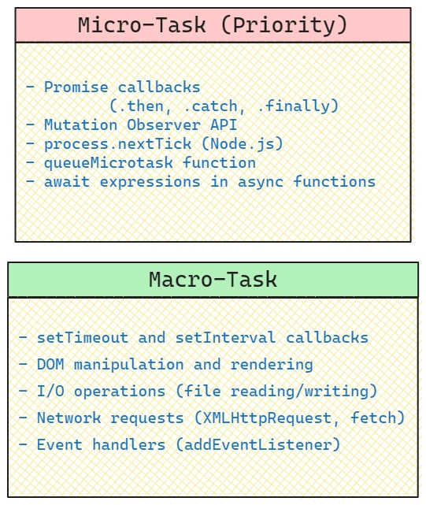

## Resources

- [Event Loop Explained](https://javascript.info/event-loop)
- [Understanding the Event Loop](https://developer.mozilla.org/en-US/docs/Web/JavaScript/EventLoop)

### Microtasks

> `Promise`, `MutationObserver`, `process.nextTick`, `queueMicrotask`

> https://javascript.info/microtask-queue

All microtasks are completed before any other event handling or rendering or any other macrotask takes place.

> All Operations that are related to the environment state, where no changes are made in same tick, such as Promise resolution, MutationObserver callbacks, and process.nextTick in Node.js, are executed in the microtask queue.

### Macrotasks

> such as `timers`, `I/O events` like filesystem, `network requests` and `user interface events`, `rendering`

The macrotask queue contains the callbacks of operations that are less urgent such as timers, I/O events, and user interface events.

> All Operations that changes the environment state, such as DOM updates, File System operations, and Network requests, are executed in the macrotask queue.

#### Summary

if you need to run a task so urgently that it should be run before any other **event handling** or **rendering** then use `microtask` queue such as (`Promise.resolve().then(...)`).

if you need to run a task that is less urgent and can wait until the next event loop tick, use `macrotask` queue such as (`setTimeout(...)`). and it executes after all microtasks are completed as well as all rendering tasks.

use `queueMicrotask(...)` to add a task to the microtask queue, which will be executed after the current script execution and before any rendering or macrotasks.

#### Web Workers

For long heavy calculations that shouldn’t block the event loop, we can use Web Workers.
That’s a way to run code in another, parallel thread.

Web Workers can exchange messages with the main process, but they have their own variables, and their own event loop.

Web Workers do not have access to DOM, so they are useful, mainly, for calculations, to use multiple CPU cores simultaneously.

- [Web Workers](https://html.spec.whatwg.org/multipage/workers.html)
- [Using Web Workers](https://developer.mozilla.org/en-US/docs/Web/API/Web_Workers_API/Using_Web_Workers)
- [Web Workers in Node.js](https://nodejs.org/api/worker_threads.html)
